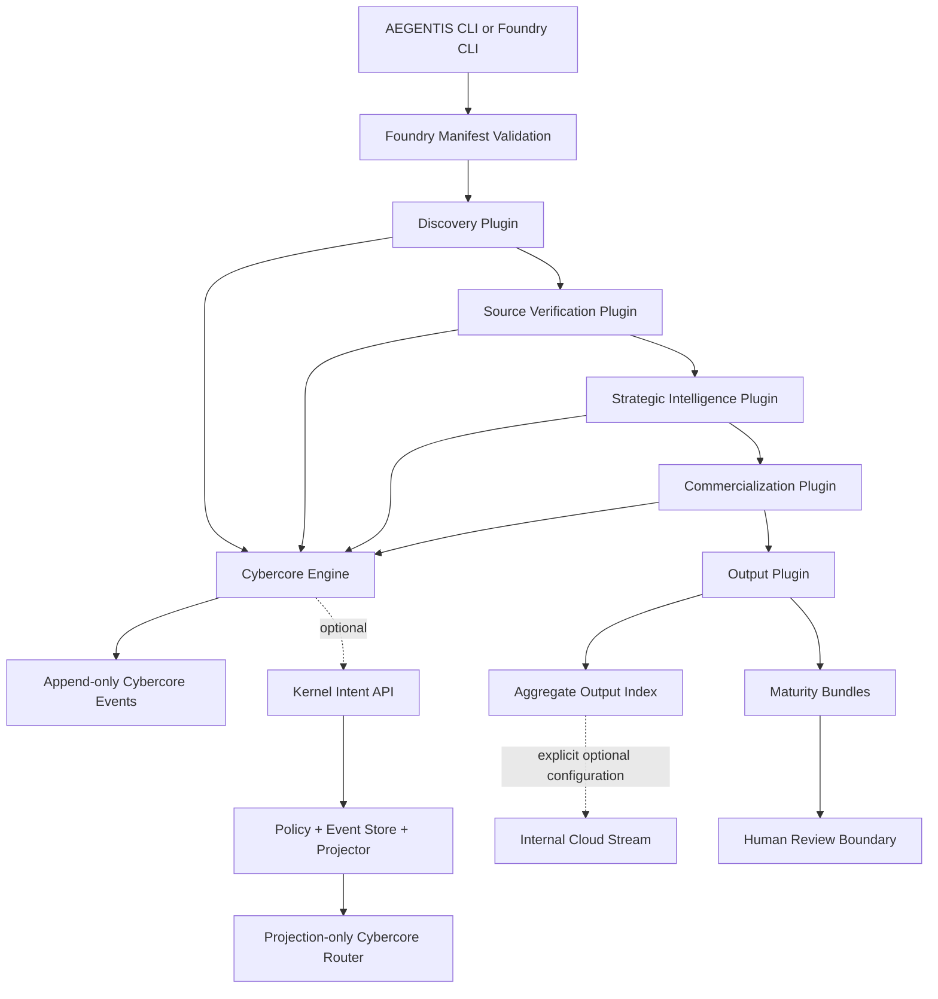

# Cybercore Opportunity Intelligence: Foundry Integration Contract

**Version:** 1.0.0

**Status:** Active

**Author:** Manus AI

## Placement decision

The canonical **Cybercore Opportunity Intelligence Pipeline** specification remains in its domain-owned location at [`CYBERCORE/opportunity_intake/docs/INTELLIGENCE_PIPELINE_SPEC_v2.md`](../../../CYBERCORE/opportunity_intake/docs/INTELLIGENCE_PIPELINE_SPEC_v2.md).[1] Foundry does not duplicate that document. The Foundry manifest links it and adds the executable composition, plugin hooks, output contracts, and operator entrypoint.[2]

This split establishes clear ownership:

| Concern | Owner | Canonical location |
|---|---|---|
| Opportunity identity, lifecycle, evidence, scoring, routing, authorization | Cybercore | `CYBERCORE/opportunity_intake` |
| Plugin composition, ordered execution, maturity outputs | Foundry | `FOUNDRY/opportunity-intelligence` |
| Plugin discovery metadata | Developer registry | `DEVELOPER/plugin-registry/registry.js` |
| Event validation, persistence, projection, replay | Kernel | `KERNEL/event-bus` |
| Optional aggregate metadata propagation | Cloud stream | `CLOUD/event-streaming` |

## Runtime architecture



The live Kernel path persists and projects accepted Cybercore events before routing. Cybercore routing remains side-effect-free, and replay never invokes the router.[3]

## Plugin execution contract

Foundry executes the manifest order exactly. Each plugin has a stable ID, semantic version, stage, hook, description, and executable function. The wrapper records start and completion timestamps, output metadata, and a SHA-256 artifact hash. Failure stops the chain and attaches a hashed failure result to the Foundry failure manifest.

| Plugin | Required precondition | Postcondition |
|---|---|---|
| Discovery | Structurally valid approved batch | Stable canonical records and discovery events |
| Source verification | Normalized records and evidence batch | Strict evidence decision and temporal state for every selected record |
| Strategic intelligence | `validation.status == VERIFIED` | Versioned, explainable five-dimension score |
| Commercialization | Verified records are scored | Commercial disposition and zero automatic Treasury handoff |
| Output engine | Canonical final records exist | One maturity bundle per record plus aggregate index |

The runtime checks that executable plugin IDs and order match the manifest before any pipeline stage runs.

## Output engine contract

The output engine creates one `<record_id>.maturity.json` bundle for each final record. The bundle binds to the full canonical record by hash and carries a maturity stage, disposition, compact summary, safety state, full record snapshot, and its own artifact hash. The aggregate `index.json` records every file path and hash plus maturity and disposition counts.

Outputs are synchronized on every run: stale maturity bundles and the prior index are removed before the new set is written atomically. Run manifests remain as durable local evidence.

| Output field | Safety meaning |
|---|---|
| `output_is_decision_support_only` | The artifact informs a decision but does not perform it |
| `authorization_required_for_external_action` | Downstream execution must verify Cybercore authorization |
| `automatic_dispatches` | Always `0` |
| `external_actions_executed` | Always `0` |
| `treasury_labs.automatic_dispatch` | Always `false` |
| `treasury_labs.handoff_executed` | Always `false` |

## Optional internal event stream

The event-stream adapter is disabled by default. When an operator explicitly supplies `--stream-url`, Foundry publishes only aggregate index metadata and hashes to `foundry.opportunity-intelligence.output`. Full opportunity snapshots remain in local output bundles. A non-local endpoint must use HTTPS, and `--stream-required` converts a publication failure into a failed Foundry run.

The stream publication is an internal metadata operation, not an opportunity submission or Treasury Labs handoff.

## Registry integration

The central registry advertises one Foundry composition named `foundry.cybercore-opportunity-intelligence`, with the manifest, entrypoint, five hooks, and capabilities. Executable logic remains in Foundry rather than the registry because the registry is the discovery catalog, not the stage runner.[4]

## Operator paths

Run directly:

```bash
node FOUNDRY/opportunity-intelligence/bin/aegentix_foundry_opportunity.js run
```

Run through the repository CLI:

```bash
node DEVELOPER/cli/aegentis.js foundry run
```

Inspect the exact composition:

```bash
node FOUNDRY/opportunity-intelligence/bin/aegentix_foundry_opportunity.js manifest
node FOUNDRY/opportunity-intelligence/bin/aegentix_foundry_opportunity.js plugins
```

## Verification contract

A release is accepted only when plugin-unit tests, output-engine tests, registry tests, optional-stream tests, the complete 22-record Foundry integration test, Cybercore regressions, Kernel regressions, strict JSON Schema validation, and a clean generated-output inspection all pass. The final observed evidence is recorded in [`VERIFICATION.md`](../VERIFICATION.md).[5]

## References

[1]: ../../../CYBERCORE/opportunity_intake/docs/INTELLIGENCE_PIPELINE_SPEC_v2.md "Cybercore Opportunity Intelligence Pipeline specification"
[2]: ../manifests/cybercore-opportunity-intelligence.plugin.json "Foundry plugin manifest"
[3]: ../../../KERNEL/event-bus/src/api/intent.js "Kernel live intent lifecycle"
[4]: ../../../DEVELOPER/plugin-registry/registry.js "AEGENTIS plugin registry"
[5]: ../VERIFICATION.md "Foundry integration verification evidence"
