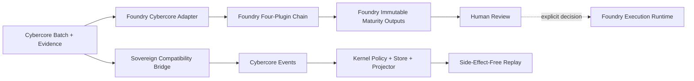

# Cybercore Opportunity Intelligence: Two-Repository Foundry Contract

**Version:** 2.0.0
**Status:** Active
**Author:** Manus AI

## Placement decision

The canonical **Cybercore Opportunity Intelligence domain specification** remains under [`CYBERCORE/opportunity_intake`](../../../CYBERCORE/opportunity_intake/docs/INTELLIGENCE_PIPELINE_SPEC_v2.md). The canonical **Foundry plugin runtime, maturity output engine, schemas, and operator command** live in the dedicated [`shalominattii-us/Foundry`](https://github.com/shalominattii-us/Foundry) repository.[1] [2]

The local `sovereign-os/FOUNDRY` package is retained as a compatibility bridge because it integrates directly with the Sovereign Kernel event bus, replay projection, developer registry, and optional internal event stream. It is not the canonical Foundry product runtime.

| Concern | Owner | Canonical location |
|---|---|---|
| Opportunity identity, lifecycle, evidence, policies, and authorization | Cybercore | `sovereign-os/CYBERCORE/opportunity_intake` |
| Pure intelligence plugins and maturity output engine | Foundry | `Foundry/agent/opportunities/intelligence` and `Foundry/agent/opportunities/integration.py` |
| Native Foundry CLI and immutable run artifacts | Foundry | `foundry-cybercore` and `Foundry/var/opportunities` |
| Sovereign Kernel event publication and replay | Sovereign OS | `sovereign-os/KERNEL/event-bus` |
| Sovereign compatibility composition | Sovereign OS | `sovereign-os/FOUNDRY/opportunity-intelligence` |
| Sovereign plugin discovery metadata | Sovereign OS | `sovereign-os/DEVELOPER/plugin-registry` |
| Optional aggregate stream propagation | Sovereign OS | `sovereign-os/CLOUD/event-streaming` |

## Runtime architecture



The Foundry runtime performs strict source verification, deterministic strategic scoring, commercialization routing, and maturity classification. Only `HUMAN_REVIEW` records may initialize execution contexts. Foundry’s execution engine still requires explicit approval at consequential boundaries.[2] [3]

The Sovereign bridge performs the equivalent local composition and can publish Cybercore events to the Kernel. Cybercore routing remains projection-only, and Kernel replay does not invoke side-effect routers.[4]

## Canonical Foundry plugin chain

| Order | Plugin | Postcondition |
|---:|---|---|
| 1 | `cybercore-source-verification` | Strict evidence decision and temporal status |
| 2 | `cybercore-strategic-intelligence` | Versioned five-dimension score or a blocked null score |
| 3 | `cybercore-commercialization-routing` | Commercial disposition and zero automatic handoff |
| 4 | `cybercore-maturity-output` | Integrity-bound maturity artifact and disposition |

The native registry rejects duplicate plugin identifiers, duplicate stages, duplicate order values, and incomplete chains. Each stage receives an immutable context and returns information only. It does not receive orchestration services, filesystem authority, credentials, network clients, or event-store access.

## Foundry output engine

The canonical Foundry output engine extends `JsonDirectoryArtifactSink`. Each immutable UTC run directory contains opportunities, evidence packets, mission candidates, mission graphs, intelligence outputs, complete bundles, and a hash-indexed v2 manifest.

| Output invariant | Required value |
|---|---|
| `automatic_dispatches` | `0` |
| `external_actions_executed` | `0` |
| `treasury_labs_handoffs_executed` | `0` |
| Intelligence plugin trace length | `4` |
| Authorization policy | `human_required` |

The machine-readable contracts are published in `Foundry/schemas/cybercore`. The canonical plugin and ownership manifest is `Foundry/manifests/cybercore-opportunity-intelligence.json`.

## Canonical operator path

Run in the dedicated Foundry repository:

```bash
foundry-cybercore \
  --batch examples/cybercore/2026-08-06/AEGENTIX-CYBERCORE-OPP-INTAKE-2026-08-06.json \
  --evidence examples/cybercore/2026-08-06/source-verification-2026-08-06.json \
  --output-root var/opportunities/cybercore-runs \
  --evaluated-at 2026-08-06T17:32:17Z
```

## Sovereign compatibility paths

Run the local bridge directly:

```bash
node FOUNDRY/opportunity-intelligence/bin/aegentix_foundry_opportunity.js run
```

Run through AEGENTIS:

```bash
node DEVELOPER/cli/aegentis.js foundry run
```

The local bridge’s manifest contains a `canonical_runtime` binding with the actual Foundry repository, merged release branch, pinned commit, canonical manifest, native command, and explicit `sovereign_os_compatibility_bridge` role.

## Verification contract

The combined release is accepted only when the Foundry-native plugin, batch, output, manifest, schema, package, and complete repository tests pass; the real 22-record interoperability fixture reproduces the verified distribution; sovereign Cybercore and Kernel regressions pass; and both repositories remain clean and synchronized.

## References

[1]: ../../../CYBERCORE/opportunity_intake/docs/INTELLIGENCE_PIPELINE_SPEC_v2.md "Cybercore Opportunity Intelligence Pipeline specification"
[2]: https://github.com/shalominattii-us/Foundry/tree/12d59571c12cc38dbe723549d119f48db2f269d0 "Canonical Foundry Cybercore Opportunity Intelligence release commit"
[3]: https://github.com/shalominattii-us/Foundry/blob/v1.0.0-rc1/docs/adr/0004-sacred-execution-boundary.md "Foundry Sacred Execution Boundary"
[4]: ../../../KERNEL/event-bus/src/api/intent.js "Kernel live intent lifecycle"
